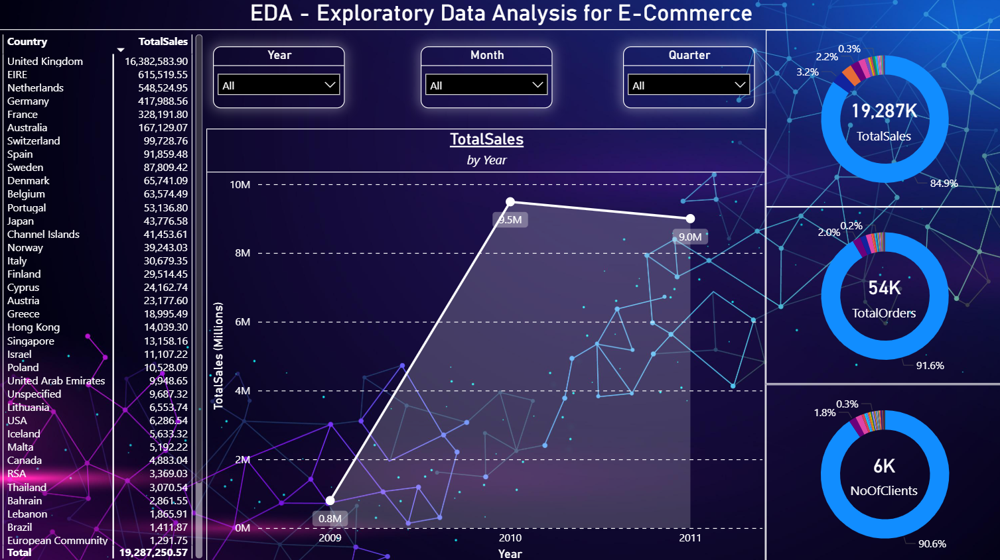
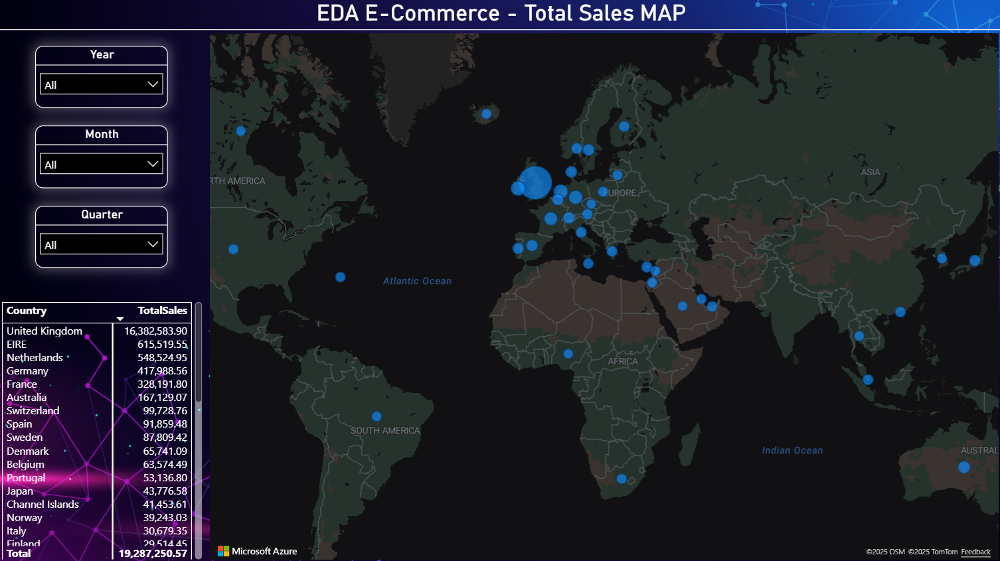

# 📊 PowerBI Project - E-Commerce Data Analysis (EDA)

⚠️ **Disclaimer:** The dataset used in this project is **fictitious**.  
This dashboard was created **only as a presentation model** and should not be interpreted as real operational data.

---
## 🔎 Description
**Application acces:** _[DaAn_EDA-Exploratory-Data-Analysis_eCommerce](https://app.powerbi.com/view?r=eyJrIjoiNGI5NzNhZGUtMDA1Yy00MDNjLWJlNTAtOTY4YWM5MjJkMmMwIiwidCI6IjU5ZTJkYTQzLWI1N2UtNDA4Ny05OGEwLWI1NDlmODczNzE0MiIsImMiOjl9)_

This project presents an **Exploratory Data Analysis (EDA)** pipeline for an **e-commerce dataset**, integrating **Python**, **SQL Server**, and **Power BI** to transform raw transactional data into meaningful business insights.  
The project was developed as part of an academic assignment at *Transilvania University of Brașov*, Faculty of Mathematics and Computer Science.

---

## 📌 Project Overview
The main objective of this project is to convert a real-world dataset of online retail transactions into a structured database and create an **interactive Power BI dashboard** for analyzing sales, customers, and geographical distributions.  

The dataset used is **[Online Retail II](https://archive.ics.uci.edu/dataset/502/online+retail+ii)**, containing transactions from a UK-based online store between **2009–2011**.

---

## ⚙️ Tech Stack
- **Python** – data cleaning, preprocessing, and ETL  
  - Libraries: `pandas`, `numpy`, `pyodbc`, `sqlalchemy`, `matplotlib`, `seaborn`  
- **Microsoft SQL Server 2021 Developer Edition** – relational database for structured storage  
- **Power BI** – interactive dashboard, DAX measures, data visualization  

---

## 📂 Project Workflow
1. **Data Extraction & Preprocessing (Python)**  
   - Load Excel sheets (2009–2010, 2010–2011) into a unified DataFrame  
   - Handle missing values and data normalization  
   - Prepare data for SQL insertion  

2. **Data Loading (SQL Server)**  
   - Create `OnlineRetailDB` database and `OnlineRetail` table  
   - Insert >1,000,000 rows via Python with error handling  
   - Ensure proper datatypes for efficient queries  

3. **Data Modeling (Power BI)**  
   - Build a **Calendar table** in DAX for time-based analysis  
   - Define KPIs:  
     - `TotalSales`  
     - `NumberOfClients`  
     - `TotalOrders`  

4. **Data Visualization (Power BI)**  
   - **Matrix Table** – sales aggregated by country and month  
   - **Slicers** – filters for year, month, and country  
   - **Area Chart** – monthly sales evolution  
   - **Cards & Donut Charts** – KPIs and country sales proportions  
   - **Map Visualization** – geographical distribution of sales  

---

## 📊 Results
The final **Power BI Dashboard** provides:  
- Sales trends over time (year, quarter, month, day)  
- Customer behavior and purchasing patterns  
- Top-performing countries by revenue  
- Interactive filtering for custom insights  

This workflow can easily be extended to:  
- Connect to live APIs or multiple data sources  
- Automate updates with scheduled Python scripts  
- Integrate predictive models for sales forecasting  

---

## 📈 Dashboards

### 🟢 Dashboard 1 – Sales Overview
- **KPI Cards** – Total Sales, Total Orders, Number of Clients.  
- **Donut charts** – percentage distribution of sales and orders by country.  
- **Line/Area chart** – yearly sales trend.  
- **Matrix table** – aggregated sales by country and time.  
- **Slicers** – filters for Year, Month, and Quarter.  

➡️ Example visualization:  


---

### 🟢 Dashboard 2 – Geographical Analysis
- **Map visualization** – global distribution of total sales.  
- Interactive zoom and hover for country-level insights.  
- **Country ranking table** – total sales per region.  
- Same slicers (Year, Month, Quarter) for filtering.  

➡️ Example visualization:  


---

## 🚀 Getting Started
1. Clone this repository:  
   ```
   git clone https://github.com/alexmarcean/edp-ecommerce-data-analysis.git
   cd edp-ecommerce-data-analysis
   ```

2. Install dependencies (Python ≥ 3.9 recommended):
   ```
   pip install pandas numpy pyodbc sqlalchemy matplotlib seaborn
   ```

3. Set up SQL Server (Developer Edition recommended).

4. Run the Python scripts to load the dataset into SQL Server.

5. Open the provided Power BI file and connect it to your SQL database.
